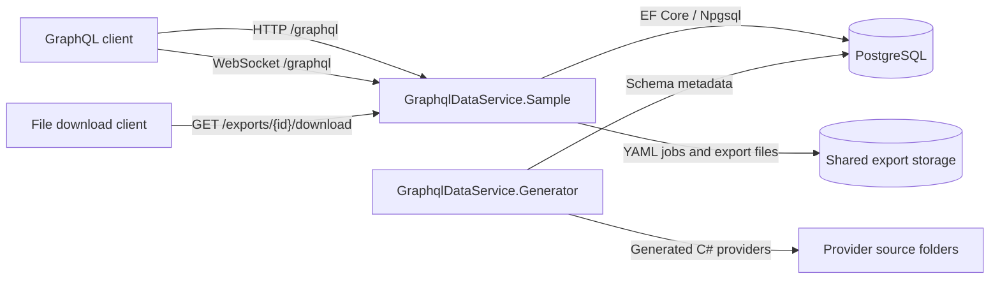
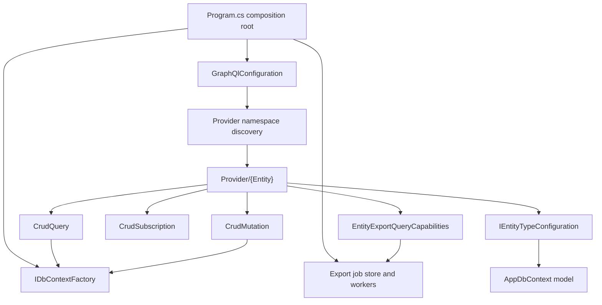
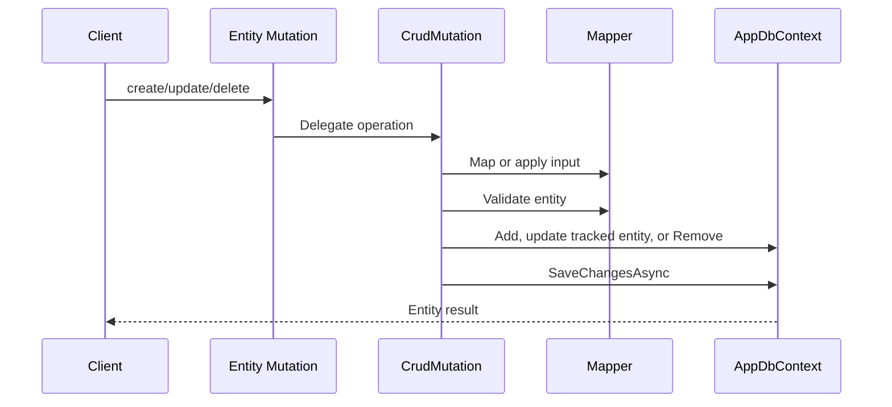
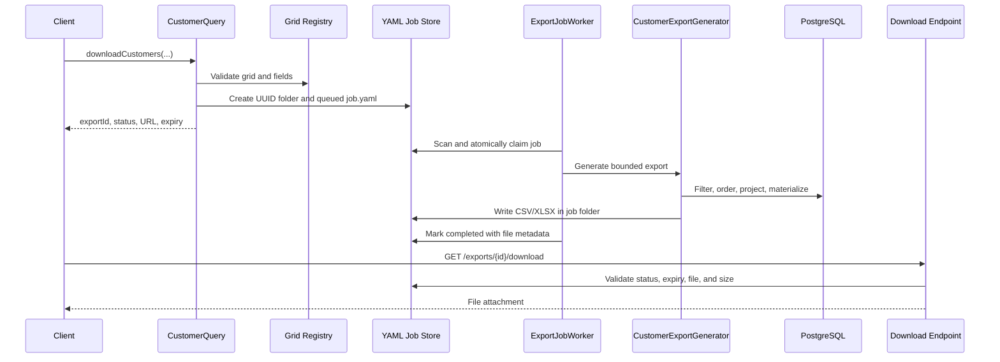
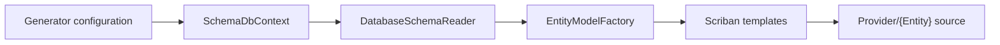

# Architecture

## Purpose

This repository demonstrates a table-oriented GraphQL data service. Each exposed database table owns an entity provider, while shared GraphQL, EF Core, grid, and export infrastructure remains entity-agnostic. A companion console application generates provider source from PostgreSQL or SQL Server metadata.

The current sample exposes one entity, `Customer`, and uses PostgreSQL at runtime.

## System Context



## Solution Components

| Component | Responsibility |
| --- | --- |
| `GraphqlDataService.Sample` | GraphQL schema, CRUD, grid metadata, background exports, REST downloads, health endpoints |
| `GraphqlDataService.Generator` | Reads PostgreSQL/SQL Server table metadata and renders provider source with Scriban |
| `GraphqlDataService.Sample.Tests` | Schema, mapper, EF model, export store, capability, and generator tests |
| PostgreSQL | Customer data and persisted `gridSchema` definitions |
| Shared export storage | Cross-server UUID job folders containing `job.yaml` and generated files |

## Service Structure



### Composition Root

`Program.cs` binds and validates GraphQL, database, and export options; configures Serilog; registers the EF context factory; registers grid/export services; starts background workers; maps GraphQL, export download, and health endpoints; and runs `DatabaseInitializer` outside the test environment.

`GraphQlConfiguration` creates named Query, Mutation, and Subscription roots. There are no marker `Query.cs` or `Mutation.cs` classes.

### Dynamic Provider Discovery

`GraphQL:ProviderNamespacePrefix` identifies the namespace scanned for provider types. Discovery registers:

- classes marked with `[ExtendObjectType]` as GraphQL type extensions;
- `ICrudMapper<,,,>` implementations as scoped services;
- `IEntityExportQueryCapabilities<>` implementations as singletons;
- `IExportGenerator` implementations as scoped enumerable services.

`Database:ProviderNamespacePrefix` separately controls discovery of `IEntityTypeConfiguration` classes in `AppDbContext`.

The application fails startup when no GraphQL provider types exist under the configured namespace.

## Entity Provider Design

An entity provider is a vertical slice:

```text
Provider/Customer/
├── Data/
│   ├── Customer.cs
│   └── CustomerConfiguration.cs
├── CustomerInputs.cs
├── CustomerMapper.cs
├── CustomerQuery.cs
├── CustomerMutation.cs
├── CustomerSubscription.cs
├── CustomerFilterType.cs
├── CustomerSortType.cs
├── CustomerQueryCapabilities.cs
└── CustomerExportGenerator.cs
```

`EntityBase` is an empty marker. Concrete entities declare their own key and audit properties. CRUD keys are generic through `TKey`; the Customer provider uses `Guid`. Deletes are physical hard deletes.

## GraphQL Query Pipeline

The Customer collection applies Hot Chocolate middleware in this order:

1. cursor paging, including `totalCount`;
2. projection;
3. explicitly bound filtering;
4. explicitly bound sorting.

`CrudQuery<TEntity>` returns `DbSet<TEntity>.AsNoTracking()` without materialization. Hot Chocolate composes the requested projection/filter/order/paging into the EF query.

The current Customer entity has no navigation fields or nested resolvers, so it has no active N+1 query path. When relationships are introduced, mapped navigations should remain projection-compatible and separately resolved fields should use DataLoaders.

## Mutation Pipeline



`ICrudMapper` owns entity-specific mapping and validation. The generic base owns lookup, persistence, hard deletion, cancellation, and `NOT_FOUND` errors. Database uniqueness and concurrency exceptions are currently sanitized as internal errors rather than translated to entity-specific codes.

## Grid Definitions

`gridDefinition(entityName, gridViewName)` reads an active definition from `app.gridSchema`. The JSON document contains display metadata and export field permissions. The registry currently reads PostgreSQL for every request; it does not cache definitions.

Both export query variants require a grid definition:

- explicit-column exports validate columns and field capabilities against the active `default` grid;
- named-view exports use visible columns, stored filters/order, and the view’s optional format.

`DatabaseInitializer` can seed registered `IEntityGridDefinition` implementations, but the current Customer provider has no code seed. Fresh environments must provision `Customer/default` explicitly.

## Export Architecture



`ExportJobWorker` uses bounded `Parallel.ForEachAsync`; `MaxConcurrentExports` limits simultaneous job processing. `YamlExportJobStore` uses `claim.lock` for ownership and atomic replacement for YAML updates. Jobs are retried up to `MaxAttempts`, and cleanup removes expired inactive folders on `CleanupIntervalMinutes`.

Status subscriptions poll YAML at `StatusPollingIntervalSeconds` and emit only status changes. Completed updates include the REST URL.

## Source Generator

The generator pipeline is:



PostgreSQL and SQL Server readers load columns, nullability, primary keys, identity flags, and maximum lengths. The generator requires one primary key and supports identity numeric keys or application-generated `Guid` keys. It does not currently reproduce non-primary indexes, relationships, or custom business validation.

## Deployment Topology

The application can run on multiple servers when every server shares:

- the same PostgreSQL database;
- the same durable export storage root;
- filesystem semantics supporting exclusive file creation and atomic replacement.

The in-memory GraphQL subscription provider is process-local, but export status subscriptions poll shared YAML directly, so they do not depend on cross-server topic delivery.

## Security And Operational Boundaries

The sample currently has no authentication, authorization, export ownership, or tenant isolation. `RequestedBy` is `anonymous`. Before production:

- add authenticated GraphQL and REST access;
- enforce per-entity read/write/delete policies;
- bind every export to an owner and tenant;
- add database/schema readiness checks;
- configure query depth, cost, and execution limits;
- replace `EnsureCreated` with reviewed migrations;
- secure connection strings and shared storage;
- add telemetry and distributed operational testing.

## Known Constraints

- `MaxExecutionDepth` exists in configuration but is not enforced.
- Grid definitions are not cached and have no administrative mutation API.
- Long-running exports do not renew leases.
- The generator does not emit unique/non-primary indexes.
- The current schema is flat and has no DataLoader implementation.
